# Leaping-Into-Memories


Code implementation for "Leaping Into Memories: Space-Time Deep Feature Synthesis" [[arXiv preprint]](https://arxiv.org/abs/2303.09941)

<p align="center">
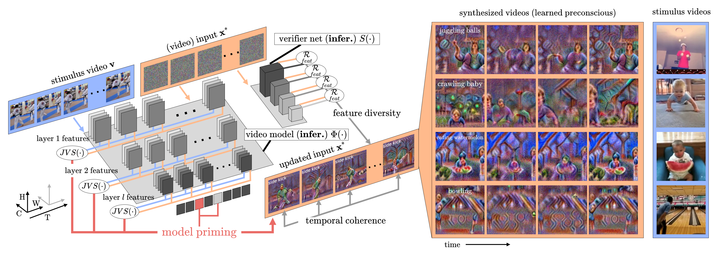
</p>

## Abstract
The success of deep learning models has led to their adaptation and adoption by prominent video understanding methods. The majority of these approaches encode features in a joint space-time modality for which the inner workings and learned representations are difficult to visually interpret. We propose <b>LEA</b>rned <b>P</b>reconscious <b>S</b>ynthesis (LEAPS), an architecture-agnostic method for synthesizing videos from the internal spatiotemporal representations of models. Using a stimulus video and a target class, we prime a fixed space-time model and iteratively optimize a video initialized with random noise. We incorporate additional regularizers to improve the feature diversity of the synthesized videos as well as the cross-frame temporal coherence of motions. We quantitatively and qualitatively evaluate the applicability of LEAPS by inverting a range of spatiotemporal convolutional and attention-based architectures trained on Kinetics-400, which to the best of our knowledge has not been previously accomplished. <p align="center">

Learned preconscious synthesis for the Kinetics class `juggling balls`
|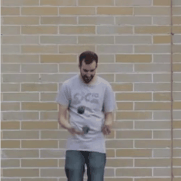|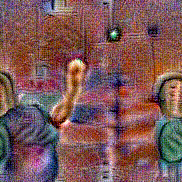|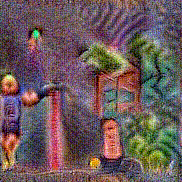|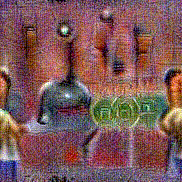|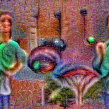|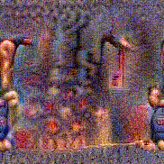|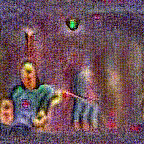|
|:-----:|:-----:|:-----:|:-----:|:-----:|:-----:|:-----:|
Stimulus |3D R50|(2+1)d R50|csn R50|X3D XS|X3D S| X3D M |
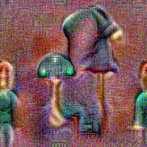|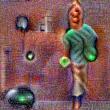|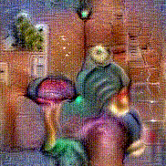|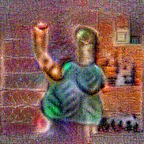|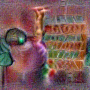|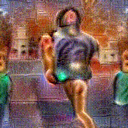|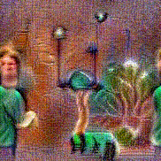
X3D L | TimeSformer | SWIN T|SWIN S|SWIN B|MViTv2 S|MViTv2 B|
|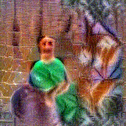|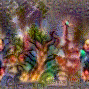|
rev-MViT | Uniformerv2 B |Uniformerv2 L

Learned preconscious synthesis for the Kinetics class `dribbling basketballs`
|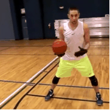|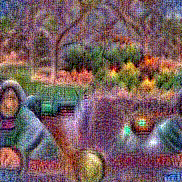||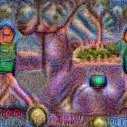|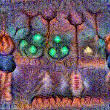|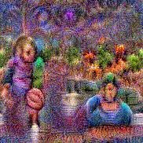||
|:-----:|:-----:|:-----:|:-----:|:-----:|:-----:|:-----:|
Stimulus |3D R50|(2+1)d R50|csn R50|X3D XS|X3D S| X3D M |
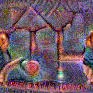|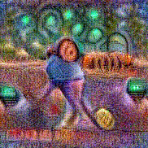|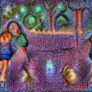|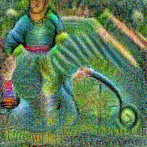|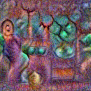||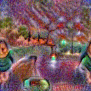
X3D L | TimeSformer | SWIN T|SWIN S|SWIN B|MViTv2 S|MViTv2 B|
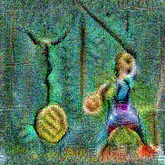|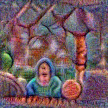|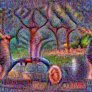|
rev-MViT | Uniformerv2 B |Uniformerv2 L


## Dependencies

The required packages are listed below

- `torch >= 1.13.0`
- `torchvision >= 0.14.0`
- `numpy >= 1.22.4`
- `pandas >= 1.3.4`
- `einops >= 0.6.0`
- `tqdm >= 4.65.0`
- `wget >= 3.3`


## Datasets

A set of Kinetics-400 videos used as stimuli during gradient updates is required for using the codebase. You will need to pass the directory as an argument when calling `run.py` with `--stimuli_dir`.

## Usage

Use a call to `run.py` with the appropriate arguments. e.g.:

```
python run.py --store_dir='my_dir' --reg=0.1 --model='x3d_xs' --verifier 'x3d_xs' --lr 0.6 --gpu_ids 0 --resolution 182 --num_frames 4 --stimuli_dir k400_stimuli

```

## Citation

```bibtex
@article{stergiou2023leaping,
  title={Leaping Into Memories: Space-Time Deep Feature Synthesis},
  author={Stergiou, Alexandros, and Nikos Deligianis},
  journal={arxiv preprint},
  year={2023}
}
```


## Licence

MIT
